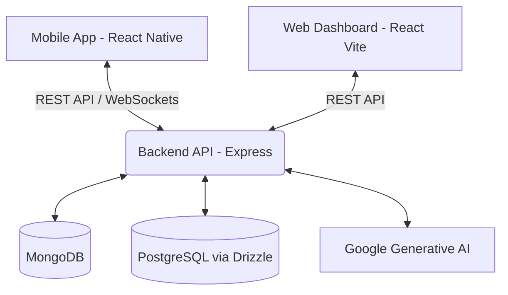

<div align="center">


<h3>
<span style="color:white;">🐾</span> Bridging the gap in Pet Care, One Paw at a Time! <span style="color:white;">🐾</span>
</h3>


  <p align="center">
    <a href="#-about-the-project">About</a> •
    <a href="#-architecture--tech-stack">Tech Stack</a> •
    <a href="#-core-features">Features</a> •
    <a href="#-getting-started">Installation</a> •
    <a href="#-contributing--workflow">Workflow</a>
  </p>

  <div>
    
    
    
  </div>
</div>

---

## 📖 About The Project

**PetZeno SuperApp** is a next-generation, all-in-one ecosystem dedicated to modern pet parents. 

Managing a pet's life—from vaccination records to veterinary appointments, finding nearby pet parks, and accessing emergency SOS services—is often fragmented across multiple platforms. PetZeno unifies these experiences through a seamless **Web Portal** and a high-performance **Mobile Application**, all powered by a robust, AI-integrated **Node.js Backend**.

### 💡 Why PetZeno?
- **Unified Identity:** Unique digital profiles for every pet.
- **Smart AI Assistant:** Instant, reliable pet-care advice powered by Google's Generative AI.
- **Cross-Platform:** Accessible anywhere, heavily optimized for both mobile and desktop.

---

## 🏗 Architecture & Tech Stack

The project is structured as a Monorepo containing three core microservices/apps:

<table>
  <tr>
    <td width="30%">
      <h3>🌐 Web Portal</h3>
      <code>petzeno-web</code>
    </td>
    <td>
      Built for clinic dashboards and power users.<br>
      <b>Tech:</b> React 19, Vite, Tailwind CSS, Framer Motion, Lenis (Smooth Scroll), Firebase, Recharts.
    </td>
  </tr>
  <tr>
    <td width="30%">
      <h3>📱 Mobile SuperApp</h3>
      <code>petzeno-expo</code>
    </td>
    <td>
      A native-feeling, fully-featured mobile app.<br>
      <b>Tech:</b> React Native 0.81, Expo 54, Drizzle ORM, PostgreSQL (pg), React Query, Expo Location, Maps, Zod.
    </td>
  </tr>
  <tr>
    <td width="30%">
      <h3>⚙️ API Server</h3>
      <code>petzeno-backend</code>
    </td>
    <td>
      The brain connecting the apps and the database.<br>
      <b>Tech:</b> Node.js, Express 5, MongoDB (Mongoose), Google Generative AI (@google/generative-ai).
    </td>
  </tr>
</table>

### 🗺 System Flow



### 📂 Full Project Structure

<details>
<summary><b>Click to expand the detailed folder tree</b></summary>

```text
Petzeno-SuperApp/
│
├── ⚙️ petzeno-backend/        # Node.js/Express API Server
│   ├── .env                   # Environment variables (MongoDB, Gemini API)
│   ├── server.js              # Main API server entry point
│   ├── models/                # Mongoose Database Schemas
│   ├── routes/                # Express API Routes
│   └── seed_*.js              # Database Seeder Scripts
│
├── 📱 petzeno-expo/           # React Native Mobile Application
│   ├── app/                   # Expo Router Pages & Layouts
│   ├── components/            # Reusable UI Components
│   ├── constants/             # App-wide constants & Colors
│   ├── context/               # React Context (Auth, Cart, Pet)
│   ├── hooks/                 # Custom React Hooks
│   ├── shared/                # Shared Schema & Types
│   ├── drizzle.config.ts      # Drizzle ORM Config
│   └── app.json               # Expo App Configuration
│
└── 🌐 petzeno-web/            # React Vite Web Dashboard
    ├── public/                # Static Images & Logos
    ├── src/
    │   ├── components/        # Reusable Web UI Components
    │   ├── layouts/           # Page Layouts (Dashboard View)
    │   ├── lib/               # Firebase setup & Mock DB
    │   ├── pages/             # All Web Routes (Admin, Clinics, Landing...)
    │   ├── App.jsx            # Main React Component
    │   └── index.css          # Tailwind/Global Styles
    └── vite.config.js         # Vite Configuration
```

</details>

---

## ✨ Core Features

| Feature                 | Description                                                                                          | Availability |
|-------------------------|------------------------------------------------------------------------------------------------------|:------------:|
| 🏥 **Health Records**   | Secure, digital vault for vaccinations, prescriptions, and medical history.                          | ✅ Web / 📱 App |
| 🤖 **AI Vet Assistant** | 24/7 intelligent answering for pet diet, behavior, and care tips.                                    | ✅ Web / 📱 App |
| 📍 **Geo-Services**     | Real-time Map integration to find nearby Vets, Parks, and Pet Stores using `expo-location`.          | 📱 App       |
| 🚨 **SOS & Emergency**  | Instantly flash pet health data and alert nearby clinics in case of emergency.                       | 📱 App       |
| 📊 **Dashboards**       | Data visualization using Recharts to track pet weight, diet, and expenses.                           | ✅ Web       |

---

## 🚀 Getting Started

Follow these instructions to set up the project locally.

<details>
<summary><b>1. ⚙️ Setup the API Backend</b></summary>

```bash
cd petzeno-backend
npm install

# Setup your Environment variables
cp .env.example .env
# Edit .env to add MONGO_URI and GEMINI_API_KEY

npm run dev
```
</details>

<details>
<summary><b>2. 📱 Setup the Mobile App</b></summary>

```bash
cd petzeno-expo
npm install

# Start the Expo Metro Bundler
npx expo start
```
*Note: Use the **Expo Go** app on your phone to scan the QR code.*
</details>

<details>
<summary><b>3. 🌐 Setup the Web Portal</b></summary>

```bash
cd petzeno-web
npm install

npm run dev
```
</details>

---

## 🤝 Contributing & Workflow

Currently, development is active on the `feature/collab` branch. 
To contribute:

1. Create a new branch or work directly in `feature/collab`
2. Commit your changes following Conventional Commits format (e.g., `feat: add AI diet planner`)
3. Sync changes to the upstream if collaborating.
4. Finally, open a Pull Request against the `main` branch when ready.

---

<div align="center">
  <p>Made with ❤️ by the PetZeno Team.</p>
  <i>Empowering pet parents everywhere.</i>
</div>
